<!-- README.md -->
<!--цветовая палитра палитра #DB8C7B #EBD2CD #3B887B #125446 #112221 -->
<!-- Волны -->

  

$$ \large\color{#3B887B}\rule{780pt}{2pt} $$

  
  &nbsp;&nbsp;
  

$$ \large\color{#3B887B}\rule{780pt}{2pt} $$

  

$$ \large\color{#3B887B}\rule{780pt}{2pt} $$

  <!-- Ряд 1: Языки + Фреймворки -->
  
  
  
  
   
  
  <!-- Ряд 2: Базы данных + DevOps -->
  
  
  
  
  
   
  
  <!-- Ряд 3: Очереди + Мониторинг + ML -->
  
  
  
  
  

  

